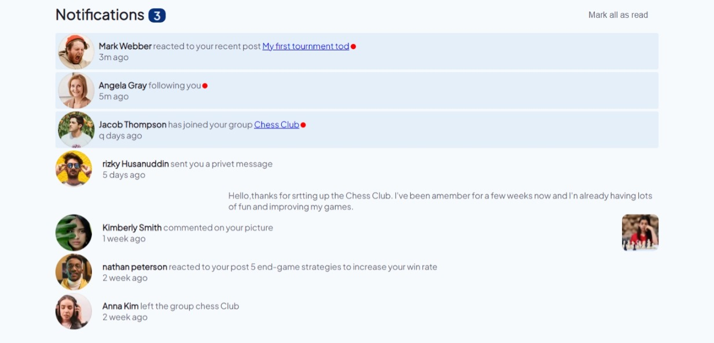

# intro-section-with-dropdown-navigation-main
 - [The challenge](#The-challenge)
- [Screenshot](#Screenshot)
- [Links](#Links)
- [Built with](#Built-with)
- [What I learned](#What-I-learned)
- [Continued development](#Continued-development)

## Overview

### The challenge

Users should be able to:

- Distinguish between "unread" and "read" notifications
- Select "Mark all as read" to toggle the visual state of the unread notifications and set the number of unread messages to zero
- View the optimal layout for the interface depending on their device's screen size
- See hover and focus states for all interactive elements on the page

### Screenshot

### Links

- Live Site URL: [live URL](https://intro-section-with-dropdown-01.netlify.app/)

### Built with

- Semantic HTML5 markup
- CSS custom properties
- Flexbox
- CSS Grid
- Mobile-first workflow
- basic Javascript

### What I learned

-basic Dom javascript understanding
-mobile size adjustment

### Continued development

-learn more tips and tricks on css platform
-have better understanding on basic javascirpt
-improve my short coming
